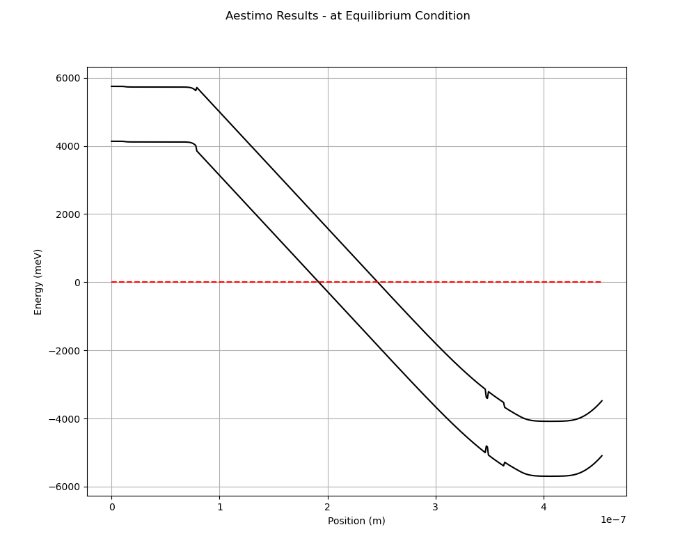
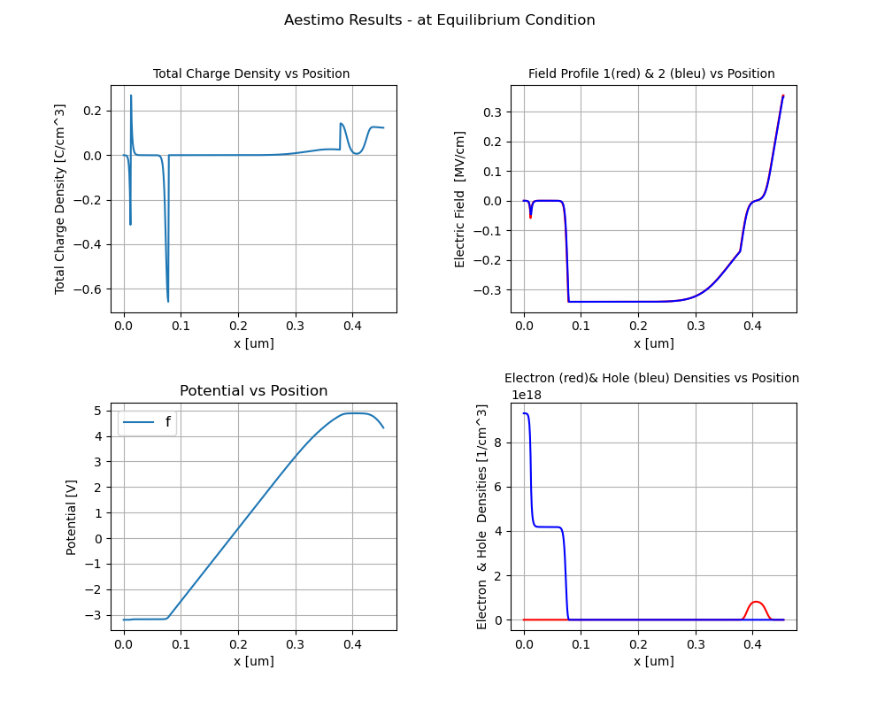
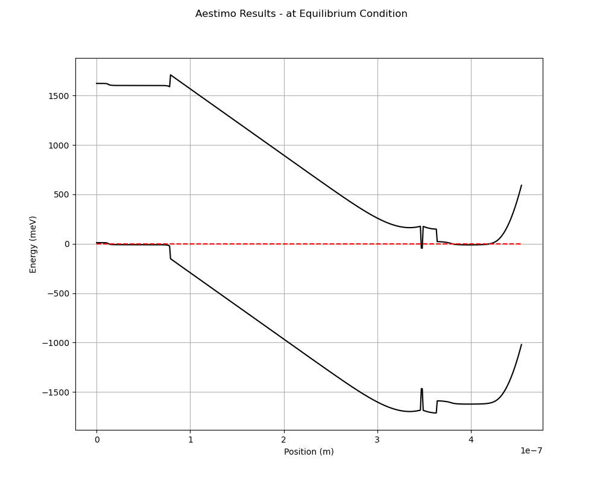
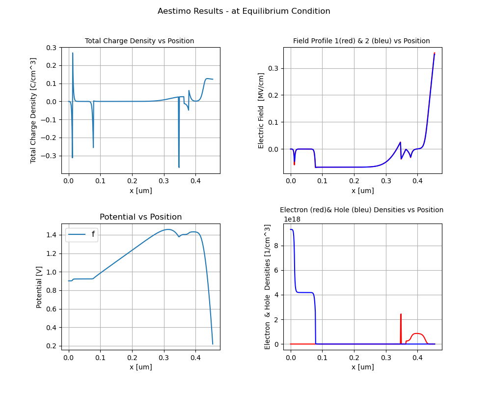
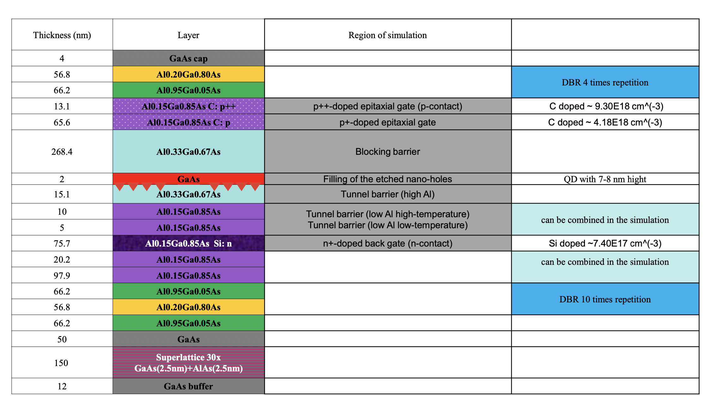
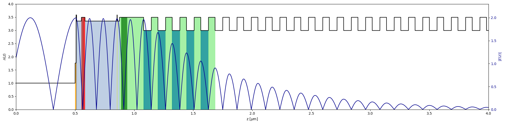

Supervisor: Mete Atature
 
# abstract

The utilization of classical integrated photonic technologies and devices in quantum applications is known as integrated quantum photonics. Single photon sources with high purity have been demonstrated using semiconductor quantum dots as a confinement for exciton generation, as well as advanced nanofabrication techniques. Optical cavity and waveguides embedded with quantum dots are popular methods for manipulating quantum state. One of the current challenges in universal quantum computation is verifying quantumness, which can be accomplished through Boson sampling. This computational task is believed to be difficult for classical computers, but can be efficiently solved by orchestrated Bosonic interference in a specialized quantum computer. Near-unity efficient single photon sources have made these experiments possible by the production of indistinguishable photons. This review of solid-state quantum optics research will provide a deeper understanding of its near-term applications.

# Introduction

Integrated quantum photonics (IQP) has emerged as a promising platform for the generation, manipulation, and detection of single photons. With the rapid advancements in nanofabrication techniques, researchers have been able to integrate various quantum photonic components onto a single chip, enabling precise control over the generation and manipulation of individual photons. Among the crucial components in integrated quantum photonics is the single photon source, which plays a fundamental role in applications such as Boson sampling.

Traditionally, single photon sources were realized using bulk optics setups, which are complex and challenging to miniaturize. However, by leveraging the principles of integrated photonics, as with integrated electronics, researchers have made significant strides in developing compact and efficient single photon sources that can be seamlessly integrated into chip-scale devices. These integrated single photon sources offer several advantages over their bulk counterparts, including enhanced stability, scalability, and compatibility with on-chip quantum circuits.

\newenvironment{Figure}
  {\par\medskip\noindent\minipage{\linewidth}}
  {\endminipage\par\medskip}
\begin{Figure}
 \centering
 \includegraphics[width=\linewidth]{img/klm.jpeg}
 \captionof{figure}{Implementation of a Hadamard gate with a beam splitter and a mirror. Top part is the quantum circuit. Beam splitter is represented as a unitary operation while mirror as rotation matrix.}
\end{Figure}

One approach to realizing single photon sources in IQP is through the use of quantum emitters embedded in photonic waveguides or cavities. Quantum dots (QD), for example, have been extensively studied as solid-state emitters capable of emitting single photons on demand. By integrating quantum dots with photonic structures, such as nanowires or photonic crystal cavities, researchers have achieved high-efficiency single photon emission with precise control over the emission wavelength and polarization.

In this paper, we review the recent advancements in GaAs based single photon sources using integrated quantum photonics. We discuss the background of light matter interaction in QD (section 2), different approaches (section 3), and fabrications (section 4). Furthermore, we explore the applications and future prospects of integrated single photon sources in the context of Boson sampling (section 5) and other emerging quantum technologies.

% Quantum technologies enable the manipulation of individual quantum objects such as photons for encoding and transferring information, providing a significant advantage over classical technologies. Over the past few years, numerous experiments have been conducted to increase the control over quantum states and extend the decoherence time to facilitate precise computation of quantum algorithms. For instance, ion trap \cite{Kielpinski2002} technology utilizes a combination of electric and magnetic fields to isolate ions from the external environment, while superconducting systems leverage the Josephson effect \cite{Golubov2004} at low temperatures. However, photons, weakly coupled to the environment, do not require milli-kelvin temperatures and are not susceptible to information leakage when coupled with matter, making them an ideal candidate for quantum information processing.

% Quantum technologies manipulate individual quantum object like photons to encode and transfer information, which demonstrates a dramatic advantage over the classical ones. In recent years there are various experiments conducted to make quantum states controllable with longer decoherence time to allow accurate computation of quantum algorithms. For example, ion trap uses combination of electric and magnetic fields to allows ions to be isolated from the external environment \cite{Kielpinski2002}, superconducting system exploits Josephson effect at low temperatures \cite{Golubov2004}. However, weakly coupled to the environment, photons neither require milli-kelvin temperature nor suffer from information leakage when coupled matter, which makes it another ideal candidate for quantum information processing. In particular, single photon of light in integrated quantum photonics (IQP) combined with semiconductor quantum dots offers a compelling platform for future technologies.

% In 2000, Knill, Laflamme, \& Milburn (KLM) \cite{Knill2000} showed that scalable quantum computing is possible by only combining single photon source (SPS) , linear optical circuit, beam splitter phase shifter and single photon detectors (SPD).

% Initially, it was difficult to create large-scale circuits with bulk optics due to their physical size. As with integrated electronics, the need for practicality led to the development of integrated quantum photonics (IQP), which enable the integration of various components with complementary functionalities into a single circuit, creating a versatile platform for on-chip generation. GaAs, in the form of semiconductor quantum dots (QD), is a well-known candidate.
% But they soon realized that due to physical size it is hard to create large scale circuits with bulk optics. Similar to integrated electronics, the requirement of practicality demands quantum photonic integrated circuits (QPIC), with which different components with complementary functionalities can be integrated in a single circuit, providing a versatile platform for on-chip generation. Various platforms for QPIC has been demonstrated successfully such as: silica-on-silica \cite{Spring2013} and gallium nitride (GaN) \cite{Xiong2011}. GaAs is also one of the well-known candidates, in the form of semiconductor quantum dots (QD). And more interestingly it is a mature source of single photon emission, owing to its low-loss waveguides as well as high refractive index which allows for confinement of light. These techniques underpin the promising applicability of QD as a qubit source for quantum state generation as well as efficient boson sampling.

% \begin{Figure}
%  \centering
%  \includegraphics[width=\linewidth]{img/GaAs.png}
%  \captionof{figure}{a. Schematics of the GaAs quantum-dot (QD) heterostructure grown on GaAs(001) substrate. The GaAs quantum-dot layer is in the middle of a pre-stressed (In)AlGaAs membrane. b. Atomic force microscopy (AFM) image of a representative droplet-etched nanohole on the AlGaAs surface before GaAs filling.}
% \end{Figure}

% Here the review focus on GaAs based quantum dots technology. The background of quantum dot will be introduced in section 2. Two ways to generate single photon source, namely cavity and waveguides are explained in section 3. In section 4 the full fabrication process of IQP devices will be described while in the last section we will give analysis on Boson sampling which is one of the most important applications of QD technology.

\section{Semiconductor QD}
\subsection{quantum dot}

\begin{Figure}
 \centering
 \includegraphics[width=\linewidth]{img/qd.png}
 \captionof{figure}{Schematic illustration of the changes of the density of quantum states (DOS) with changes in the number of atoms in materials}
\end{Figure}

Quantum dots are materials that have dimensions and atom numbers falling between the atomic-molecular level and bulk materials, and their band-gap depends on a variety of factors \cite{bera2010andholloway} in a complex manner. For instance, the band gap of InAs quantum dots sandwiched between GaAs layers is much larger at 1.25 eV, as opposed to the bulk InAs value of $\sim$0.4eV. Isolated single atoms exhibit sharp and narrow luminescent emission peaks, while nanoparticles consisting of 100-1000 atoms display different narrow optical lines. The most critical feature of quantum dots is their quantum confinement \cite{banyai1993semiconductor}, which imparts a $\delta$-function-like density of states as in Figure 2.

% Quantum dots have dimensions and numbers of atoms between atomic-molecular level and bulk materials with a band-gap that depends in a complicated fashion upon a number of factors \cite{bera2010andholloway}. For example the band gap of InAs quantum dot sandwiched between GaAs layers is measured to be 1.25 eV, much larger than the value for the bulk InAs $\sim$0.4 eV. For isolated single atom, sharp and narrow luminescent emission peaks are observed while different narrow optical lines are seen in nanoparticles with 100-1000 atoms. The most important property of QD is quantum confinement \cite{banyai1993semiconductor}, which makes it have a $\delta$-function-like density of states (atomic-like since its size is smaller than bulk material).

Quantum confinement arises when electrons are confined to a region comparable in size to their de Broglie wavelength, and the energy level spacing of the nanocrystal exceeds $k_bT$. When electrons are excited across the band-gap, interesting properties emerge as they interact with the valence band hole, resulting in single or multiple excitons populating the quantum dot.

% Quantum confinement emerges when electrons are constrained to a domain comparable with their de Broglie wavelength and the energy level spacing of the nanocrystal exceeds kT, restricting the electron mobility. QD is size dependent. So as QD becomes smaller, confinement increases the effective band-gap, leading to blue shift of absorption and emission spectra. Interesting properties show up when electrons are excited across the band-gap. They experience interactions with valence band hole, leading to single or multiple excitons populating QD. Quantum dots were first fabricated with high-temperature precipitation in molten glasses \cite{yoffe1993low}.

\subsection{Excitons in quantum dots}
Dominated by quantum confinement, electrons and holes in QD behaves like a two-level system, where the lowest-energy electronic excitation (heavy-hole exciton, $\mathbf{X}$) involves one electron in the conduction band and one hole in the valence band \cite{huo2014light} as shown in Figure 4. Within high energy scale, biexciton and multiexcitons are possible with coulomb interactions. 

% \begin{Figure}
%  \centering
%  \includegraphics[width=\linewidth]{img/hole.png}
%  \captionof{figure}{Typical band structure with heavy holes and light holes separated by spin-orbit coupling}
% \end{Figure}

Usually the the heavy-hole–light-hole degeneracy is lifted in a self-assembled QD by the difference in effective masses of valence band and the asymmetric shape of the confinement, which has aspect ratio larger than unity with the dominant quantization axis being the growth direction. Most researches dealt with heavy holes because they are energetically above light ones thus a higher density of states.

\subsection{Bright and Dark excitons}

Single photons are generated when an electron-heavy-hole pair has anti-parallel spins, which is referred to as a bright exciton. Conversely, when the electron and hole spins are parallel to one another, a dark exciton is produced. The exchange interaction between the pair leads to energy splitting, known as fine structure splitting (FSS), between the bright and dark states.

% \begin{figure*}
% \includegraphics[width=8cm]{img/split.png}
% \centering
% \captionof{figure}{Scheme of the exciton fine structure in a magnetic field aligned in the Voigt configuration. Here the dot-asymmetry induced exchange energy splittings d 1 and D1 of the bright excitons as well as the hybridization energy d 2 of the dark excitons vanish. \cite{bayer2002fine}}
% \end{figure*}

The bright exciton preferentially decays through radiative recombination channel while dark exciton decay through non-radiative channels. Although this means that the dark exciton has much longer lifetime, we need bright excitons as the photon source. Interestingly, by engineering the spin-flip, dark exciton undergoes a transition into a bright exciton \cite{mueller2018exciton}.

\begin{Figure}
 \centering
 \includegraphics[scale=0.4]{img/hv.png}
 \captionof{figure}{Radiation decay path for bright exciton with different polarisations and their deacy rate as $\Gamma$. The fine structure splitting is depicted as $\Delta$.}
\end{Figure}

\begin{figure*}
\begin{center}
\includegraphics[scale=0.4]{img/sum_exciton.png}
\captionof{figure}{The QD level scheme where b and d are the bright and dark exciton states, respectively. The full (empty) circles indicate the electron (hole) configuration in the conduction (valence) band of the quantum dot. The biexciton may decay to one of the two bright exciton states by emission of a horizontally (H) or vertically (V) polarized photon. Furthermore, spin-flip processes (gray arrows) couple bright and dark excitons. Here only the nonradiative decays of the bright excitons are indicated explicitly.}
\end{center}
\end{figure*}

\subsection{Exciton exciton interaction}

Having considered the aforementioned points, we can now establish the requirement for generating a pair of polarization-entangled photons from biexcitons. Each photon can exhibit one of two mutually complementary polarizations, denoted as horizontal (H) and vertical (V) in reference to the asymmetry axis of the quantum dot (QD) \cite{akopian2006entangled}, as depicted in Figure 3. We can then write out the state as:

% With all that said, we finally can state the condition to collect polarisation-entangled pair from
% biexcitons. 
% Each photon can have either of the two possible complementary polarizations, which we denote horizontal (H) and vertical (V) as in figure 3 above, having corresponding photon polarizations relative to the asymmetry axis of the QD \cite{akopian2006entangled}. We can write out the state as:

\begin{equation}
    \ket{\psi} = \frac{1}{\sqrt{2}} ( \ket{H_{XX}} \ket{H_{X}}  +  \ket{V_{XX}} \ket{V_{X}} )
\end{equation}

To achieve entanglement, two conditions must be met \cite{benson2000regulated}: the intermediate exciton states should be degenerate, and the final state of the quantum dot (QD) must be unaffected by the decay path. Suppression of Fine Structure Splitting (FSS) is crucial as it allows the biexciton to decay into two bright excitons with opposite circular polarizations. In order to generate an entangled pair of excitons, the FSS value must be smaller than the exciton linewidth to ensure that the decay process is indistinguishable. The state of art fidelity of entanglement generation has already exceeded 97\% \cite{huber2018strain}.

% Entanglement is possible only if the intermediate exciton states are degenerate and the final state of QD is independent of the decay path \cite{benson2000regulated}. If FSS is suppressed, biexciton decay into two bright excitons with opposite circular polarization. So to create an entangled pair of excitons, FSS must be smaller than exciton linewidth to make the decay indistinguishable. The state of art fidelity of entanglement generation has already exceeded 97\% \cite{huber2018strain}.

\begin{Figure}
 \centering
 \includegraphics[width=\linewidth]{img/intensity _ex.png}
 \captionof{figure}{Non-resonant photoluminescence spectrum of a GaAs QD showing exciton(X), biexciton(XX) and trion($X^-$, $X^{+}$) transitions. The upper panel schematically depicts the QD charge configuration for each transition.}
\end{Figure}

\section{Photonic Structure}
\subsection{Cavity}
Another way to create indistinguishable photon is by employing single photon source.
A high-quality single-photon source produces photons with a well-defined quantum state, which ensures that each emitted photon has consistent properties, such as narrow temporal emission profiles, polarization, and spatial mode. But typically, such device suffer from poor performance as photons are emitted randomly in space, and dephasing mechanisms are strong. However, the use of a quantum emitter embedded in a cavity with a high Q factor and a small mode volume can improve photon's indistinguishability. This is achieved by reducing photon's spectral linewidth. Cavity acts as a filter, only allowing photons of a certain frequency to pass through. By choosing the appropriate cavity parameters, the spectral linewidth of the emitted photons can be narrowed, leading to indistinguishable photons. The efficiency can be enhanced by increasing the spontaneous emission rate of the emitter relative to its value in bulk or free space, through coupling it to the cavity mode, a phenomenon known as the Purcell effect. Consequently, the fraction of photons coupled to the cavity mode that are redirected towards a specific output increases, thus improving the external out-coupling efficiency. Furthermore, the Purcell effect significantly reduces the radiative lifetime below the dephasing time, resulting in increased purification of emitted photons and a higher possible repetition rate of the source.
% Single-photon efficiency and indistinguishability are normally poor because photons are emitted in random directions in space, and dephasing mechanisms are strong. However, both efficiency and indistinguishability can be improved by embedding a quantum emitter into a cavity that has a high Q factor and a small mode volume, enhancing the spontaneous emission rate of the emitter relative to its value in bulk (or free space) as a result of its coupling to the cavity mode (known as the Purcell effect). In this case, the external out-coupling efficiency is improved by increasing the fraction of photons coupled to the cavity mode that are redirected towards a particular output where they can be collected. In addition, as a result of the Purcell effect, the radiative lifetime is reduced significantly below the dephasing time, increasing the indistinguishability of emitted photons and the possible repetition rate of the source. 

Two decisive parameters for cavity-QED are quality factor Q and effective mode volume V, represented as:

\begin{equation}
    F_{p} = \frac{\Gamma_{cav}}{\Gamma_{bulk}} = \frac{3}{4\pi^{2}} (\frac{\lambda}{n})^{3} \frac{Q}{V_{eff}}
\end{equation}

where $\Gamma_{cav}$ means the decay into the targeted mode while $\Gamma_{bulk}$ is the one in the whole bulk materials.

Note that in this context, F represents the maximum achievable value of the Purcell factor. Since the mode volume of nanophotonic cavities is not easily measurable, the Purcell factor experienced by a quantum emitter when resonating with the cavity is often used as a metric. To achieve a large F, it is important to ensure deterministic photon emission into a single optical mode and the efficiency, $\beta$ (equation 3), is defined as the ratio of the emission into the target mode compared to all modes.
% Note here the F means the maximum value Purcell factor can achieve. Because the mode volume is not a readily measurable quantity for nanophotonic cavities, we normally choose instead to specify the Purcell factor that a quantum emitter in the cavity experiences when being resonant with the cavity. To get a large F, we need to ensure a deterministic photon emission into a single optical mode can be achieved with an efficiency close to unity for a very large F, for example, QD strongly coupled to cavity \cite{press2007photon}. The effciency $\beta$ is defined as fowlloing. With higher beta, the more emission is enhanced at a specific target mode.

\begin{equation}
    \beta = \frac{F_{p}}{F_{p}+1} = \frac{\Gamma_{mode}}{\Gamma_{mode}+\Gamma_{others}}
\end{equation}

However, in practical photonic cavities, it is highly probable that the resonance is slightly offset due to imperfections in growth and processing. Achieving nanometer-scale accuracy for a photon with a specific wavelength becomes an exceedingly challenging task. Although cavities can yield significantly higher Purcell factors compared to methods like waveguides, this advantage comes at a cost. When the enhanced mode of the cavity exhibits a slightly detuned wavelength, emitted photons may become trapped within the cavity instead of being emitted outward. To overcome this obstacle, precise engineering of the cavity is necessary, ensuring that its reflectivity is low enough to allow photon emission while maintaining a sufficiently high quality factor. Several studies have been conducted to solve these issues, such as adjusting the temperature \cite{thoma2016exploring}, as the electronic band and refractive index have different dependencies. However, increasing the temperature increases the decoherence associated with photons. Other post-growth tuning mechanisms, such as the application of external magnetic fields \cite{beetz2013anisotropic} or strain, are experimentally more challenging \cite{sun2013strain}.

% Localized light can be greatly enhanced when confined to a small mode cavities. But this leads to a huge problem because in real photonic cavity with embedded QD it is most likely that the resonance is slightly detuned as a result of growth and processing imperfections. It is tremendously hard to fabricate at nanometer accuracy for a single wavelength photon. Other than that, cavities in general can achieve much higher purcell factor compared to method like waveguides. But this comes with a greater cost: when the enhanced mode has a slight detuned wavelength, emitted photon can never get out thus trapping in the cavity. Also, we need to precisely engineer the cavity such that its reflectivity is low enough to to emit a photon out, but high enough to maintain the quality factor. There are many studies on solving these issues, for example, adjusting the temperature as the electronic band and refractive index have different dependencies. But the downside is that temperature increases the decoherence associated with photons thus ruining the distinguishability \cite{thoma2016exploring}. Experimentally more challenging are other post-growth tuning mechanisms such as the application of external magnetic fields \cite{sun2013strain} or strain \cite{beetz2013anisotropic}.

\subsection{Micropillar cavities}

Micropillar cavities are a popular choice for High-Q cavities and are typically fabricated using alternating layers of different refractive indices grown epitaxially. Each layer has a thickness of $\lambda=4n_i$ (where i=1,2) and forms a Bragg mirror with reflectivity controlled by the number of layers. The height of the micropillar is typically around 10 $\mu$m, with a diameter of a few microns. However, there is a trade-off between volume size \cite{srinivasan2007linear} and quality factor, as smaller cavities have a restricted lateral extension of the guided mode but are also more sensitive to sidewall roughness \cite{gazzano2013bright}. The Bragg mirror is grown to allow one side of the cavity to be highly reflective while the other is optimized for photon transmission. High-Q factors can be observed in micropillar resonators up to 250,000 \cite{schneider2016quantum}, making them ideal for vertical-emitting single-photon sources. While out-of-plane confinement relies on total internal reflection at the membrane-air interface, air holes are drilled in a lattice geometry of semiconductor material, to achieve in-plane confinement by introducing a photonic band gap.  Micropillar cavities with embedded QDs have been shown to generate single photons with high efficiency and an indistinguishability of 90\% was recently reported \cite{ates2009indistinguishable}.

% Micropillar cavities has been widely used for high Q cavities and it is usually fabricated with epitaxial growth of alternating layers. Each layer has refractive indeices of either $n_{1}$ or $n_2$ with thickness $\lambda=4n_i$ (where i=1,2), and the typical height of micropillar is around 10 $\mu$m with a typical diameter of a few microns. By controlling the diameter of micropillar the layers can form a Bragg mirror with reflectivity controlled by number of layers(another way is to use internal reflection to trap light called microdisk. However, this method suffer from the relatively large mode volumes \cite{srinivasan2007linear}). The mirror are often grown to allow one side of the cavity to be highly reflective while the other with optimized transmission to emit photons. However, there is a trade off between volume size and quality factor similar to what we mentioned earlier. To restrict lateral extension of guided mode, cavity requires small volume. But choosing a diameter around 1-2 micrometer has been shown to significantly reduce Q due to sensitivity to sidewall roughness \cite{gazzano2013bright}. High Q factors can be observed in micropillar resonators up to 250,000 \cite{schneider2016quantum}). However, while micropillars with embedded QD are ideal vertical-emitting single-photon sources, they do not match the requirements of dense quantum photonic integrated circuits that involve in-plane photon routing and processing. The state-of-art micropillar cavities can generate single photons with high efficiency and indistinguishabilities of up to 81\% by excitation of quantum dots \cite{farrow2008single} and an indistinguishability of 90\% was even recently reported for a single-photon source \cite{ates2009indistinguishable}.

% This photonic structure is most commonly realized by drilling air holes in a lattice-geometry into a membrane of semiconductor material. In-plane confinement is then achieved by the photonic band gap introduced by the holes etched into the membrane, while out-of-plane confinement fully relies on total internal reflection at the membrane-air interface.

\begin{Figure}
 \centering
 \includegraphics[width=\linewidth]{img/cav.png}
 \captionof{figure}{Left: The Bragg stack above and below the center of the pillar confines light to the central region as shown in the inset. Right: Modified photonic-crystal L3 cavity implemented in a membrane. Typical quality factor Q for the two cases are: $\sim 6x10^{4}$ and $\sim 3x10^{4}$}
\end{Figure}

\subsection{Photonic-crystal cavity}

When light is confined in a very small cavity, it consists of numerous plane wave components with wavevectors k of various magnitudes and directions. This makes it difficult to achieve Bragg reflection condition. A better approach is to use structures having a two-dimensional periodic change of refractive index on the scale of the light wavelength, which are known as photonic crystals.

A promising approach is a 2D photonic-crystal slab with a thickness of the order of the light wavelength, as it provides strong optical in-plane confinement. Light is trapped in the plane and can only escape through the vertical direction. The oscillations in the 2D crystal lead to a preferential angle of emission close to the surface of the plane, making it easy to collect the photon. By displacing the holes at each end of the cavity by just a fraction of a lattice constant, the Q factor can be boosted, and the leakage of radiation modes is greatly suppressed.

% The L3 cavity is one of the most successful and important designs obtained from a 2D triangular lattice in a photonic-crystal membrane by leaving out three holes. It has a mode volume of less than $(\frac{\lambda}{n})^{3}$ with a Q factor of $3x10^{4}$ \cite{hennessy2007quantum}. Recently, a modified L3 cavity in silicon at a wavelength of 1.55$\mu$m was experimentally observed to have a cavity Q factor of $2x10^{6}$ \cite{lai2014genetically}.

% Light confined in a very small cavity consists of numerous plane wave components with wavevectors k of various magnitudes k and directions owing to the localization of light. So it is difficult to achieve bragg reflection condition. Structures having a two-dimensional periodic change of refractive index on the scale of the light wavelength is the best approach, which are known as photonic crystals.

% A 2D photonic-crystal slab, as shown in, with a thickness of the order of the light wavelength is very promising, owing to strong optical in-plane confinement. Light is trapped in the plane and the only possible way out is through z direction. It is not hard to collect the photon as oscillations in the 2D crystal lead to a preferential angle of emission close to the surface of the plane. Q can be boosted by displacing the holes at each end of cavity by just a fraction of a lattice constant and the leakage of radiation modes are greatly suppressed \cite{kippenberg2004demonstration}. One of the most successful and important designs so far is the L3 cavity that is obtained from a 2D triangular lattice in a photonic-crystal membrane by leaving out three holes, leading to a mode volume of less than $(\frac{\lambda}{n})^{3}$ \cite{hennessy2007quantum} with Q factor $3x10^{4}$. And recently, a cavity Q factor of $2x10^{6}$ has been observed experimentally in modified L3 cavities in silicon at a wavelength of 1.55$\mu$m \cite{lai2014genetically}.

\subsection{Waveguides}

Waveguides have the advantage over cavities as quantum emitter in the open system can be channelled directly into propagating mode as flying qubit. In contrast, cavity needs localized modes. If the waveguide mode has slow group velocity and a tight confinement of the mode, the photon matter coupling is enhanced. This can be seen from the equation:

\begin{equation}
    F_{p}^{max}(\omega) = (\frac{3}{4n\pi} \frac{\lambda^2/n^2}{V_{eff}/a}) n_g(\omega)
\end{equation}

where n is the group index $\frac{c}{v_g}$ that specifies the slow-down factor of the waveguide. In fabrication, the structural dispersion of the Bloch modes gives rise to slow light and the mode is tightly confined to the diffraction-limited defect area. In plasmonic nanowires, Figure 7, subwavelength confinement combined with the slow propagation of the lowest-order guided mode leads to potentially large Purcell factors \cite{chang2006so}.

\begin{Figure}
 \centering
 \includegraphics[scale=0.4]{img/nano.png}
 \captionof{figure}{Plasmonic waveguides is widely used. A coupled quantum dot can either spontaneously emit into free space or into the guided surface plasmons of the nanowire with respective rates $\Gamma_{rad}$, $\Gamma_{pl}$.}
\end{Figure}

% \begin{Figure}
%  \centering
%  \includegraphics[scale=0.4]{img/wave.png}
%  \captionof{figure}{Photonic-crystal waveguide membrane containing a single layer of quantum dots in the center of the membrane (indicated by
% triangles).}
% \end{Figure}

Waveguides rely on spontaneous-emission inhibition in all modes except one \cite{bleuse2011inhibition}, known as mode matching. To collect photons in one direction only, tapered fibre is introduced as conventional waveguides and a metallic mirror spaced by a dielectric layer is placed at the end of nanowires. Another advantage over cavity is that waveguides have higher tolerance of deviation. A range of wavelength can propagate in the plane and the efficiency of photon collection is greater than cavity subjecting to the similar detuning.

\begin{equation}
    \beta(\omega) = \frac{\gamma_{wg}}{\gamma_{wg} +\gamma_{ng} +\gamma_{nrad}}
\end{equation}

where $\gamma_{ng}$ is the loss rate of coupling to all nonguided modes and $\gamma_{nrad}$ is the rate of intrinsic nonradiative recombination in the quantum dot. The near unit beta stems from the fact that the 2D photonic band gap suppresses $\gamma_{ng}$, i.e., the leakage to unwanted modes is strongly inhibited.

However, waveguides like photonic crystal suffer from imperfections as well: the backscattering of the propagating mode into the counter-propagating direction in the waveguide and out-of-plane scattering due to coupling to leaky modes that are above the light line. The former (latter) is characterized by an average length $l_{back}$ $(l_{leak})$ leading to a total extinction length $\frac{1}{l_{ext}} = \frac{1}{l_{back}} + \frac{1}{l_{leak}}$ that determines how the average intensity decays along the waveguide.

\section{Fabrication}
\subsection{Growth of semiconductor QD}
% Crystal-growth procedure combined with semiconductor processing methods such as electron-beam lithography, etching, and deposition constitutes the generic nanofabrication platform on which the significant experimental progress within quantum nanophotonics during the past decades is built.

% The material composition and size determine the energy range of the emission spectrum of quantum dots. In particular, the lowest-energy transition of InAs quantum dots typically falls in the range of 850 to 1000 nm, while GaAs quantum dots typically emit at around 670 to 760 nm. The choice of material also affects photonic properties, in particular, through the real part of the index of refraction. In general, longer wavelength implies that fabrication of nanostructures is easier and that the relative importance of fabrication imperfections is reduced. Furthermore, the material absorption is smaller at longer wavelengths, which allows for, e.g., higher Q factors of optical nanocavities. On the other hand, silicon-based photodetectors such as avalanche photodiodes are much more efficient at shorter wavelengths and therefore lead to higher photon-count rates, although this obstacle may be overcome by the use of superconducting detectors. A trade-off between these factors determines the most ideal wavelength for a given experimental setting.
% Here we will give overviews on two major fabrication methods for quantum dot technology.
The progress in quantum nanophotonics over the past few decades has largely relied on a generic nanofabrication platform that combines crystal-growth procedures with semiconductor processing methods, such as electron-beam lithography, etching, and deposition.

% The energy range of the emission spectrum of quantum dots is determined by their material composition and size. Typically, the lowest-energy transition of InAs quantum dots falls between 850 to 1000 nm, while GaAs quantum dots emit at around 670 to 760 nm. The choice of material also affects the photonic properties, particularly through the real part of the index of refraction. Longer wavelengths make nanostructure fabrication easier and reduce the relative importance of fabrication imperfections. Additionally, absorption is smaller at longer wavelengths, allowing for higher Q factors of optical nanocavities. However, shorter wavelengths are more efficient for silicon-based photodetectors such as avalanche photodiodes, leading to higher photon-count rates. This challenge may be addressed through the use of superconducting detectors. Ultimately, the most ideal wavelength for a given experimental setting depends on a trade-off between these factors.

In this context, we will provide an overview of two major fabrication methods in quantum dot technology.
\subsection{Stranski-Krastanov}

Stranski-Krastanov \cite{stranski1938zar} method for InGaAs QD is most extensively studied in QD materials like InAs and InGaAs in GaAs matrices. The huge difference in band-gap energies between InAs (0.422eV) and GaAs (1.522eV) at 4 K and the three-dimensional quantum confinement makes it possible to tune the QD emission in a very large spectral window - from almost 850 nm up to 1400 nm - by adjusting the QD dimensions.

The lattice mismatch between InAs and GaAs creates strain during deposition: The growth of InAs on a GaAs (100) surface initially results in a thin two-dimensional (2D) wetting layer (WL), this is when more than 1.7 monolayers of InAs is deposited on GaAs. Due to the lattice-mismatch, the 2D growth mode turns into a three-dimensional (3D) growth after deposition of a few monolayers, resulting in the creation of randomly positioned QDs with a pyramidal shape (shown in Figure 8 (a)). A capping layer of GaAs is added to prevent oxidation \cite{eisele2008change} and the intermixing results in a truncated pyramid. As crystal growth proceeds, the accumulated strain energy increases, a transition occurs and the total energy is minimized by creating InAs islands form coherent islands of InGaAs on GaAs surfaces. By stopping the growth right after this transition, the islands are typically 10–30 nm lateral size in the in-plane directions and 2–5 nm out of plane.

\begin{Figure}
 \centering
 \includegraphics[scale=0.35]{img/sk.png}
 \captionof{figure}{Schematic capping process of a pyramidal InAs QD
(a) overgrown by GaAs layers with increasing thicknesses (b-e).}
\end{Figure}

% The lattice mismatch between InAs and GaAs gives rise to a considerable strain when the two materials are deposited on top of each other. The size of the islands is thereby extremely sensitive to the amount of material that is deposited. The growth of InAs on a GaAs (100) surface initially results in a thin two-dimensional (2D) wetting layer (WL), this is when more than 1.7 monolayers of InAs is deposited on GaAs. Due to the lattice-mismatch, the 2D growth mode turns into a three-dimensional (3D) growth after deposition of a few monolayers, resulting in the creation of randomly positioned QDs with a pyramidal shape. As crystal growth proceeds, the accumulated strain energy increases, a transition occurs and the total energy is minimized by creating InAs islands form coherent islands of InGaAs on GaAs surfaces. By stopping the growth right after this transition, the islands are typically 10–30 nm lateral size in the in-plane directions and 2–5 nm out of plane.

% In order to prevent the QDs from oxidation and to separate them from the surface, they are commonly overgrown by a capping layer of GaAs completing the three-dimensional quantum confinement. The capping changes the shape of the QDs from purely pyramidal to truncated pyramidal \cite{eisele2008change}. During the capping process, intermixing between the capping material and the QDs might occur leading to the formation of In(Ga)As QDs. This intermixing strongly affects the QD composition and potential profile as well as the QD emission.

\subsection{Droplet epitaxy}
A sometime undesired feature of the SK QDs is the unavoidable presence of the WL at the base of the dots, which generates bidimensional electronic states interconnecting the dots. This affects the QD optical properties and carrier kinetics. The WL is also detrimental in device performances, since it represents a channel for carrier escape out of the QDs. But this can be avoided by droplet epitaxy (DE).

\begin{Figure}
 \centering
 \includegraphics[scale=0.1]{img/DE.png}
 \captionof{figure}{Red arrows: direct incorporation of GaAs crystallization at the liquid–solid interface. Blue arrows: As adsorption on the surface surrounding the droplet, surface termination is changed and diffusion of Ga out of the droplet by capillary forces takes place. Blue dots indicate Ga atoms. As are yellow dots.}
\end{Figure}
Droplet epitaxy is a new technique where gallium droplets saturated with arsenic create large, low-density GaAs quantum dots in AlGaAs without a lattice-mismatch. First group-III atoms are deposited on the surface, then group-V flux is supplied to the surface to crystallize the droplets as in Figure 9. Post-growth annealing with a relatively high temperature is needed to make them optically active, which means the demonstrated quantum efficiency cannot yet compete with Stranski-Krastanov, but this method can grow large QDs in dimension and is strain-free.
% Droplet epitaxy is an emerging growth technique, where droplets of gallium are saturated with arsenic, resulting in relatively large and low-density GaAs quantum dots in AlGaAs. This relies on the affinity of some group-III elements on a semiconductor surface and has the advantage that it does not require a lattice-mismatch between the involved materials. Since the AlGaAs capping layer is often grown at low temperatures, a high-temperature post-growth annealing is required to make them optically active and the demonstrated quantum efficiency cannot yet compete with Stranski-Krastanov quantum dots, but this method can grow large QD in dimension and is strain free.

% Ga atoms are firstly deposited on AlGaAs layers. Then by excess As desorption, the additional deposition of group-III metal adatoms leads to the spontaneous formation of nanometre-scale droplets, as water droplets on a glass window, irrespective of the lattice mismatch. This annealing is called droplet crystallisation, during which each single droplet becomes the starting point of one nanostructure, whose shape and topology can be tailored by controlling the process such as changing temperature.

% \begin{Figure}
%  \centering
%  \includegraphics[width=\linewidth]{img/fab.png}
%  \captionof{figure}{Atomic force micrographs from QDs grown
% by droplet epitaxy before (a) and after annealing (right) at
% 400$^\circ$C.The QDs in (b) are slightly elongated in the [11$\Bar{0}$] direction}
% \end{Figure}

\section{Application}
% Quantum algorithms can be powerful but an open problem is to what extent the correctness of the outcomes of a quantum hardware can be certified. The verification of the quantum advantage over classical computers has been heavily studied. Boson sampling represents a relevant benchmark for testing different procedures to validate the obtained calculation/simulation: An array of single-photon sources is set up from IQP devices. Then input n bosons in different modes of an m-mode linear interferometer and sample events from the distribution of bosons at the interferometer’s output modes. 
The extent to which the results of a quantum hardware can be certified is an open problem, despite the potential power of quantum algorithms. A significant area of research has focused on verifying the quantum advantage over classical computers, and Boson sampling is a useful benchmark for testing different validation methods. Boson sampling involves inputting n Bosons in different modes of an m-mode linear interferometer, sampling events from the distribution of Bosons at the output modes, and testing the obtained calculation. So now we can see the importance of indistinguishable photons, to create interference effects when multiple indistinguishable particles are superposed or overlapped. 

For example, consider N single photon Fock state:

\begin{equation}
    \ket{\psi} = \ket{m_1, m_2,...,m_N}
\end{equation}

composed of $\sum_{n=i}^{\infty} m_i$ photons, incident on an N-mode linear interferometer. Therefore, the probability of detecting $n_j$ photons at the jth output mode is given by:

\begin{equation}
    \bra{n_1, n_2,...,n_N} U \ket{\psi} = \frac{|Per(U_{st})|^2}{m_1!m_2!...m_N!n_1!n_2!...n_N!}
\end{equation}

where the left hand side is the sampled single photon probability distribution and the right is the permanent of a submatrix of the interferometer unitary, dependent upon the input and output Fock states.

The calculation of permanent, which belongs to the computational complexity class of \#P-Hard problems, implies that this is an exponentially hard task for classical computers.

Boson sampling has been experimentally demonstrated with three photons \cite{crespi2013integrated}, and scalability in imperfect conditions, such as partial distinguishability has been investigated. Scattershot Boson Sampling (SBS) is an improved method, which uses spontaneous parametric down-conversion (SPDC) \cite{zhong201812} to reduce the experimental difficulty of emitting multiple photons by inputting a set of coherent random input photon state. This is a nonlinear process that using a pulsed pump laser with a high repetition rate to generates a separate set of entangled photon pairs and then feed them into an interferometer. The scattershot technique allows for the injection of multiple photons into the interferometer simultaneously as in Figure 10 right, resulting in more efficient sampling. Inside the interferometer, the signal photons interfere with each other, generating complex interference patterns. The output of the interferometer is then measured using photon detectors placed at the output ports, which provide information about the correlations between the input photons.

% The first experimental demonstrations of Boson sampling were reported with n=3 photons \cite{crespi2013integrated}. Since then, several investigations have been performed to study the scalability in imperfect conditions, such as in the presence of losses, partial distinguishability and generic experimental errors. Another method is Scattershot Boson Sampling (SBS), which was motivated by the fact that emitting n photons simultaneously in the input is experimentally very hard to realize for large n. By using spontaneous parametric down-conversion (SPDC), a set of coherent random input photon state can reduce the task significantly. To date, the highest number of photons generated in a SBS has been experimented up to 12 \cite{zhong201812}. However, these method are non-deterministic, which means that as the number of modes in the apparatus increases, the average time required until every photon source emits a simultaneous photon increases exponentially. So to make a deterministic single-photon source array, a recent progress \cite{hamilton2017gaussian} has been made to replace Fock state with Gaussian state which negates the scalability problem as single mode squeezed states can be deterministically generated simultaneously.

% Other than boson sampling, many quantum technologies, including QKD and photonic-qubit-based quantum computation and networking \cite{adcock2019programmable}, require sources of single photons. Ideally, such a source should have a high efficiency (that is, a photon should be emitted and collected in each excitation cycle), a very small probability of emitting more than one photon per pulse (measured by the second-order coherence function), and should produce indistinguishable photons at its output. 

\begin{Figure}
 \centering
 \includegraphics[width=\linewidth]{img/boson.png}
 \captionof{figure}{A. Conceptual scheme of Boson sampling with n Bosons undergoing an arbitrary m-mode unitary transformation. B. Scattershot configuration for Boson sampling with randomly chosen inputs.}
\end{Figure}

\section{Conclusion}
% Elshaari \cite{elshaari2020hybrid} stated seven main building blocks for a quantum photonic circuit. For example, we need quantum memories to store information. Each of the special tasks implies that merely a single material system will not be sufficient. Also, quantum computers need scalability and a true advance in scalability would certainly be to go from the existing level of few photons to several hundreds of photons in the circuit. Therefore we might require hybrid integrated quantum circuits. Its conceptual idea is to combine different building blocks, which can be generally incompatible in their growth conditions and integration, in a functional circuit to perform a specific quantum task. Although it sounds impractical to implement, the fast development in IQP devices has proven that quantum technology can be reachable and could change our life in more than one way. From a theoretical perspective, the success of photonic-based Boson sampling also sheds some light on the validity of our quantum theory.

IQP has made significant progress in developing single photon sources, crucial for quantum photonic applications. Elshaari \cite{elshaari2020hybrid} proposed seven fundamental components for a quantum photonic circuit, including for example, quantum memories for information storage. However, no single material system can perform all necessary tasks. Thus, hybrid integrated quantum circuits are necessary. While this may seem impractical, recent advances in semiconductor IQP devices demonstrate the feasibility of hybrid integration, with QD as single photon source. Additionally, photonic-based Boson sampling highlights the potential of quantum technologies to achieve quantum supremacy and solve computationally challenging problems paving the way for practical quantum information processing. 

Download the full version [here]({{ site.url }}/public/assets/Integrated_Quantum_Photonics_with_Semiconductor_Single_Photon_Sources.pdf)

Besides the review, I have worked with Dr.Christian Schimpf on optimizing the wavelength fitting of cavity diode with DBR implemented. First I tried to fit the Poisson solution with the data we have:

At 50K:

At room temperature:

The doping currently only affects our electronic properties (the function of the diode), as we do not (yet) consider light absorption in our structure. So the general rule of thumb will be that there should be a node of the light electric field in the doped layer AND the doping regions should be as small as possible, but as large as necessary, in order to minimize absorption in the real structure.

The structure of the diode is shown below:

and the fitting waves:

